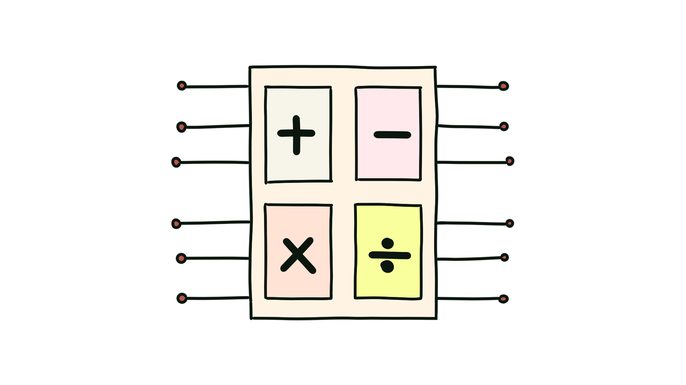

# Arithmetic

These are modules that are inherently built upon Combinational logic for arithmetic operations i.e Adder-Subtractors (deterministic or probalistic).      
Multipliers, dividers, modulo arithmetic and lograthimic evaluators, Counters and so on.