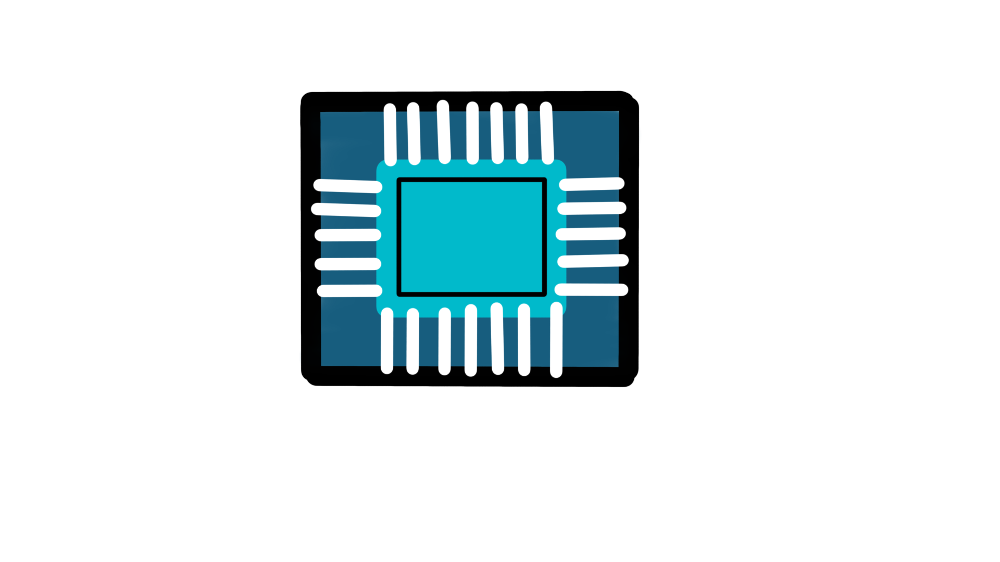

# DigtalDesign

a simple repository about programming and simulating digital design circuits in Verilog, VHDL and System Verilog Hardware language.   
Plus custome design circuits.
## Tools
Used Tools will be kept open source as possible.
- <h3 id="ghdl">GHDL</h3>
  
 
  
>For VHDL Compilation and testing  
>Could Also be used for synthesis **still under test**  
>you can see the vendors libraries supported here 
[**Supported Vendors Libraries**](https://ghdl.github.io/ghdl/getting.html#supported-vendors-libraries)   
>you can install by either building from source (**Windows**) or using a package managers (**Linux/Mac**) *apt*, *pacman* and so on...   
>**For Example** here is how to install easily from your shell for *ubuntu* or *depian* based distros.   
```shell
sudo apt-get update  
sudo apt-get install ghdl
```   
  - #### Sources
    - [**Docs**](https://ghdl.github.io/ghdl/)
    - [**Repository**](https://github.com/ghdl/ghdl)

- ### Icarus Verilog
    
>For Verilog Compilation and testing  
>Could Also be used for synthesis  
>you can install by either building from source (**Windows**) or using a package managers (**Linux/Mac**) *apt*, *pacman* and so on...   
>**For Example** here is how to install easily from your shell for *ubuntu* or *depian* based distros.   
```shell
sudo apt-get update  
sudo apt-get install iverilog
```
  - #### Sources
    - [**Docs**](https://steveicarus.github.io/iverilog/usage/installation.html)
    - [**Repository**](https://github.com/steveicarus/iverilog)


- ### Verilator
    
>For SystemVerilog Compilation and testing  
>Also used for synthesis  
>it is actually industry standard and an open source dark horse it is a very overloaded tool
>compiles to mutli-threaded c++ and SystemC you can write models in raw c++
>
>sadly doesn't support concurrent assertion proberties sequences **yet a.k.a undertest** (SVA)    
>supports all types of coverages and full coverage report 
>you can build from source (**Windows**), git or even Docker images the installation process is linked [below](#src) in sources   
>**For Example** here is how to install easily from your shell for *ubuntu* or *depian* based distros.   
```shell
sudo apt-get update  
sudo apt-get install verilator
```
  - <h4 id="src">Sources</h4>    
  
    - [**Docs**](https://veripool.org/verilator/documentation/)
    - [**Repository**](https://github.com/verilator)
    - [**Official**](https://www.veripool.org/verilator/)
    - [**Installation-Guide**](https://verilator.org/guide/latest/install.html)
   
- ### GTKWave

    
>it is an open-source [GTK](https://www.gtk.org) based wave viewer which can read
>  LXT, LXT2, VZT, FST also VHDL GHW format as well as Verilog standards VCD/EVCD
>you can install easy from **shell** in *ubuntu/depian* or build from source *Win/unix* or install in *macOs/linux* using [*homebrew*](https://brew.sh)
```shell
sudo apt-get update  
sudo apt-get install gtkwave
```
  - <h4 id="src">Sources</h4>    
  
    - [**Docs**](https://gtkwave.sourceforge.net/gtkwave.pdf)
    - [**Repository**](https://github.com/gtkwave/gtkwave/)
    - [**Official**](https://www.veripool.org/verilator/)
