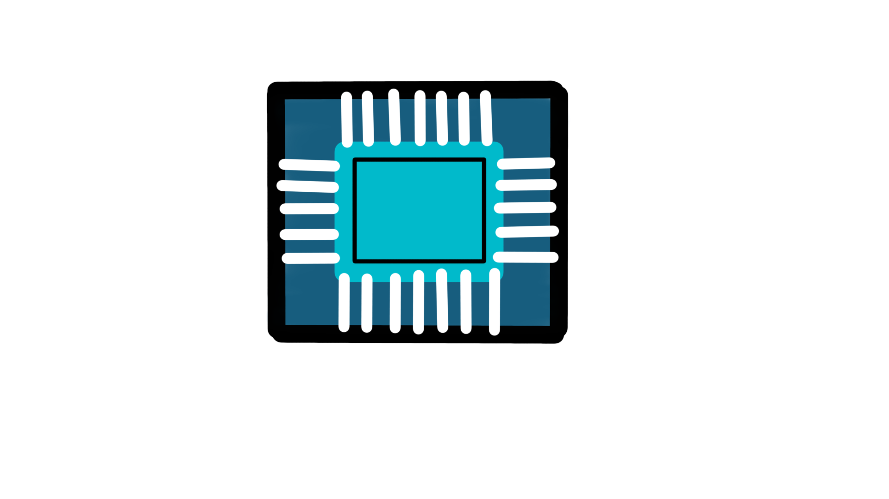

# DigtalDesign



a simple repository about programming and simulating of digital design circuits in Verilog, VHDL, System Verilog Hardware language and SystemC Transaction Level Modeling and High Level Synthesis,
also custome design circuits, layouts and backend design and testing.

## Tools

Used Tools will be kept as open source as possible.

- <h3 style="text-align: center;" id="ghdl">GHDL</h3>
  
 <p align="center">
  
 </p>

>For VHDL Compilation and testing  
>Could Also be used for synthesis **still under test**  
>you can see the vendors libraries supported here 
[**Supported Vendors Libraries**](https://ghdl.github.io/ghdl/getting.html#supported-vendors-libraries)   
>you can install by either building from source (**Windows**) or using a package managers (**Linux/Mac**) *apt*, *pacman* and so on...   
>**For Example** here is how to install easily from your shell for *ubuntu* or *depian* based distros.   
```shell
sudo apt-get update  
sudo apt-get install ghdl
```   
  - #### Sources
    - [**Docs**](https://ghdl.github.io/ghdl/)
    - [**Repository**](https://github.com/ghdl/ghdl)

- <h3 style="text-align:center;">Icarus Verilog</h3>

    <p align="center">
  
     </p>
    
    
>For Verilog Compilation and testing also supports SystemVerilog(**Not as capable as Verilator**)  
>Could Also be used for synthesis  
>you can install by either building from source (**Windows**) or using a package managers (**Linux/Mac**) *apt*, *pacman* and so on...   
>**For Example** here is how to install easily from your shell for *ubuntu* or *depian* based distros.   
```shell
sudo apt-get update  
sudo apt-get install iverilog
```
  - #### Sources
    - [**Docs**](https://steveicarus.github.io/iverilog/usage/installation.html)
    - [**Repository**](https://github.com/steveicarus/iverilog)


- ### Verilator


    <p align="center">
    
     </p>

>For SystemVerilog Compilation and testing
>Also used for synthesis  
>it is actually industry standard and an open source dark horse it is a very overloaded tool
>compiles to mutli-threaded C++ and SystemC you can write models in raw C++
>
>sadly doesn't support concurrent assertion proberties sequences **yet a.k.a undertest** (SVA)    
>supports all types of coverages and full coverage report 
>you can build from source (**Windows**), git or even Docker images the installation process is linked [below](#src) in sources   
>**For Example** here is how to install easily from your shell for *ubuntu* or *depian* based distros.   
```shell
sudo apt-get update  
sudo apt-get install verilator
```
  - <h4 id="src">Sources</h4>    
  
    - [**Docs**](https://veripool.org/verilator/documentation/)
    - [**Repository**](https://github.com/verilator)
    - [**Official**](https://www.veripool.org/verilator/)
    - [**Installation-Guide**](https://verilator.org/guide/latest/install.html)
   

- ### GCC, the GNU Compiler Collection


    <p align="center">
    
     </p>

>For C,C++ Compiletion  
>Will be used for TLM and SystemC macro extentions of c++ language for simulation of High Level Synthesis    
>**To Install** here is how to install easily from your shell for *ubuntu* or *depian* based distros (better to use g++ a dialect of gcc for c++).    
```shell
sudo apt-get update  
sudo apt-get install gcc
```
  - <h4 id="src">Sources</h4>    
  
    - [**Docs**](https://gcc.gnu.org/onlinedocs/)
    - [**Repository**](https://gcc.gnu.org/git.html)
    - [**Official**](https://gcc.gnu.org)
    - [**Installation-Guide**](https://gcc.gnu.org/install/)
- ### GNU Make


    <p align="center">
    
     </p>

>For automating and generation of executable for most platforms and across different languages compilers.  
>you can change make files to just generate the build of a module or add execution as well.  
>all you have to do is to go to a module open a terminal and just run.  
```shell
make
```

  - <h4 id="src">Sources</h4>    
  
    - [**Docs**](https://www.gnu.org/software/make/manual/)
    - [**Official**](https://www.gnu.org/software/make/)
    - [**Installation-Guide**](https://ftp.gnu.org/gnu/make/)
- ### GTKWave

    <p align="center">
    
     </p>
    
>it is an open-source [GTK](https://www.gtk.org) based wave viewer which can read
>  LXT, LXT2, VZT, FST also VHDL GHW format as well as Verilog standards VCD/EVCD
>you can install easy from **shell** in *ubuntu/depian* or build from source *Win/unix* or install in *macOs/linux* using [*homebrew*](https://brew.sh)
```shell
sudo apt-get update  
sudo apt-get install gtkwave
```
  - <h4 id="src">Sources</h4>    
  
    - [**Docs**](https://gtkwave.sourceforge.net/gtkwave.pdf)
    - [**Repository**](https://github.com/gtkwave/gtkwave/)
    - [**Official**](https://www.veripool.org/verilator/)

- ### Cadence Virtuoso
    <p align="center">
    
     </p>
>cadence is an industry standard for layout and ic design next to synopsys
>cadence is a closed source software i will use here just for demonstration purposes and schematic and layout generation of full custome circuits and layout and physical design


  - <h4 id="src">Sources</h4>
  
    - [**Official**](https://www.cadence.com/en_US/home.html)
   

- ### Schemdraw
    <p align="center">
    
    </p>
>schemdraw is a python package based on [matblotlib](https://matplotlib.org) to draw custome circuit schematics/timing diagrams and state machine diagrams
>you can install in python environment or jupyter based notebooks using *pip*
```shell
pip install schemdraw
```


  - <h4 id="src">Sources</h4>
  
    - [**docs**](https://schemdraw.readthedocs.io/)
    - [**Repository**](https://github.com/cdelker/schemdraw)
